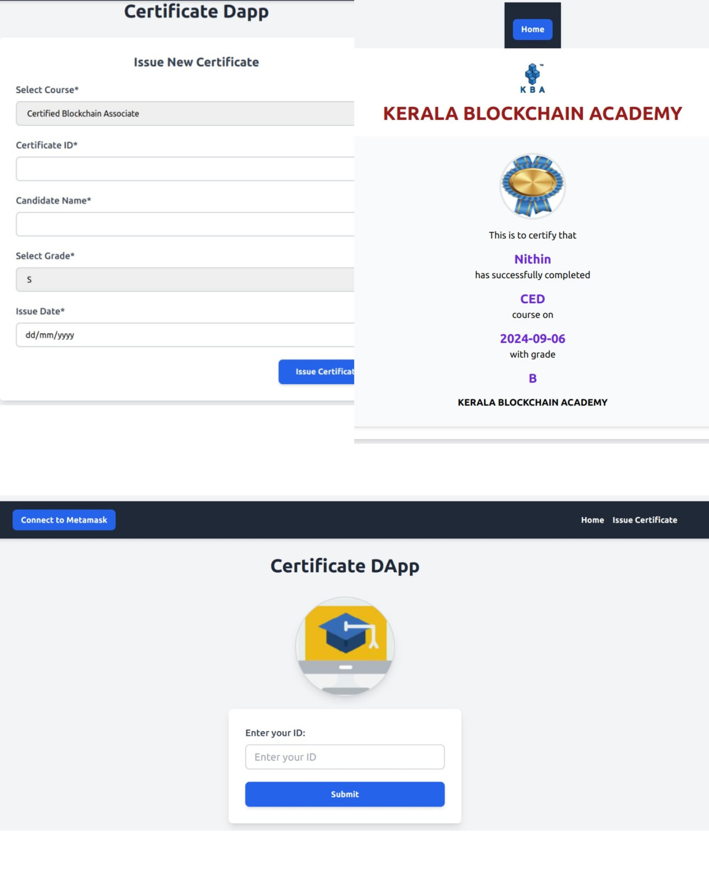

# CertiLink — Blockchain Certificate Management

A decentralised application for issuing and verifying academic and professional certificates on Ethereum. Certificates are anchored on-chain via smart contract — verifiable by anyone with a certificate ID, with no central database and no trusted intermediary required.

**[Watch the demo](https://drive.google.com/file/d/1_6vBqRGVBXi8S9eJxHmEOTpMXTQD_iaH/view?usp=sharing)**

---

## What This Does

Institutions issue certificates by recording certificate data on-chain. Recipients hold a unique certificate ID. Verifiers check authenticity directly against the contract — no login, no API call to a central server, no trust required in the issuer's infrastructure.

**Core flows:**
- **Issuer (Admin)** — issues certificates with candidate name, course, grade, and date via the Issue Certificate page
- **Holder** — receives a unique certificate ID after issuance
- **Verifier** — enters certificate ID on the Home page; data is fetched directly from the blockchain

---

## Architecture

```
┌──────────────┐        ┌─────────────────────┐        ┌──────────────┐
│    Issuer    │──────▶ │   CertiLink.sol      │ ◀───── │   Verifier   │
│  (React UI)  │ issue  │  (Ethereum / Sepolia) │ query  │  (React UI)  │
└──────────────┘        └─────────────────────┘        └──────────────┘
                                  │
                         stores: cert ID · candidate name
                         course · grade · date · issuer address
```

**On-chain:** certificate ID, candidate name, course, grade, issue date, issuer address
**Off-chain:** UI assets, certificate design templates

---

## Smart Contract

**Network:** Ethereum Sepolia testnet
**Standard:** Custom certificate registry (no ERC-721 — certificates are records, not transferable tokens)

| Function | Description | Access |
|---|---|---|
| `issue(cerid, cname, course, grade, date)` | Records a new certificate on-chain | Admin only |
| `getCertificate(cerid)` | Returns all certificate fields | Public |

Certificate IDs are human-readable and set by the issuer — no wallet address or transaction hash required to verify.

---

## Key Design Decisions

**Why on-chain storage instead of hash anchoring?**
For a PoC at this scale, storing certificate fields directly on-chain keeps the verification flow simple — verifiers read the data directly without needing access to an off-chain document. A production system would move to hash anchoring with IPFS for the full document (listed in Future Directions).

**Why not ERC-721?**
Certificates are not meant to be traded or transferred. An ERC-721 token implies transferable ownership, which is the wrong semantic for a credential. A certificate registry contract with admin-controlled issuance matches the actual trust model.

**Certificate ID as human-readable identifier**
IDs are designed to be shareable without blockchain knowledge. Verifiers enter an ID like `CERT-2024-CS-001` — no wallet, no transaction hash, no technical knowledge required.

---

## Tech Stack

| Layer | Technology |
|---|---|
| Smart Contract | Solidity 0.8.20 |
| Contract tooling | Hardhat + Hardhat Ignition |
| Frontend | React + Vite |
| Styling | Tailwind CSS |
| Wallet | MetaMask (ethers.js v6 BrowserProvider) |
| Network | Ethereum Sepolia (via Infura/Alchemy) |

---

## How to Run

### Prerequisites

- Node.js 18+
- npm
- MetaMask browser extension
- Infura or Alchemy account (for Sepolia RPC)

### 1. Clone and install

```bash
git clone https://github.com/neethu-muthu/CertiLink-DApp.git
cd UI
npm install
npm i hardhat
```

### 2. Configure Hardhat

Edit `hardhat.config.js`:

```javascript
module.exports = {
  defaultNetwork: "alchemy",
  networks: {
    localhost: {
      url: "http://127.0.0.1:8545/"
    },
    alchemy: {
      url: "YOUR_INFURA_OR_ALCHEMY_RPC_URL",
      accounts: ["YOUR_METAMASK_PRIVATE_KEY"]
    }
  },
  solidity: "0.8.20",
};
```

> Never commit your private key. Use a `.env` file with `dotenv` in production.

### 3. Compile and deploy

```bash
npx hardhat compile
npx hardhat node
```

In a new terminal:

```bash
npx hardhat ignition deploy ignition/modules/Cert.js
```

### 4. Wire up the frontend

Copy the deployed contract address and ABI into:
- `src/SCdata/deployedaddress.json` — paste deployed address
- `src/SCdata/cert.json` — paste ABI from `artifacts/`

### 5. Start the frontend

```bash
npm run dev
```

Connect MetaMask → issue a certificate → copy the certificate ID → verify on the home page.

---

## Screenshots



---

## Future Directions

1. **Hash anchoring + IPFS** — move to storing a document hash on-chain with the full certificate PDF on IPFS, reducing gas costs and enabling richer certificate formats
2. **Bulk issuance** — batch multiple certificate issuances in a single transaction
3. **Revocation** — add an admin-callable `revoke(cerid)` function with verifier-visible status
4. **Cross-chain verification** — enable verification across EVM-compatible chains via a shared registry
5. **Custom certificate templates** — allow organisations to define certificate designs tied to their on-chain identity

---

## Related Work

This project directly informed the architecture of an enterprise academic credential verification PoC — exploring public blockchain anchoring for diploma and degree verification at institutional scale.

- [Automobile Lifecycle on Hyperledger Fabric](https://github.com/Neethu-Muthu/Automobile-Minifabric-Golang)
- [SecureBallot — Permissioned voting on Fabric](https://github.com/Neethu-Muthu/SecureBallot-Hyperledger)

---

## License

MIT — see [LICENSE](LICENSE) for details.
